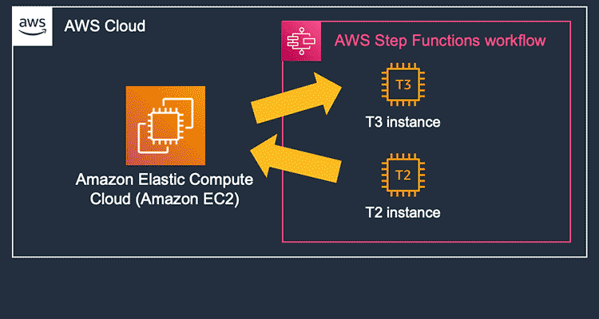
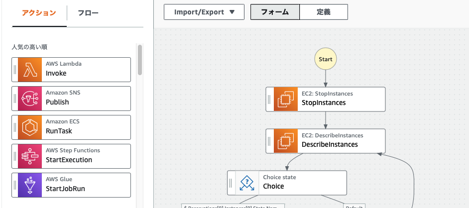
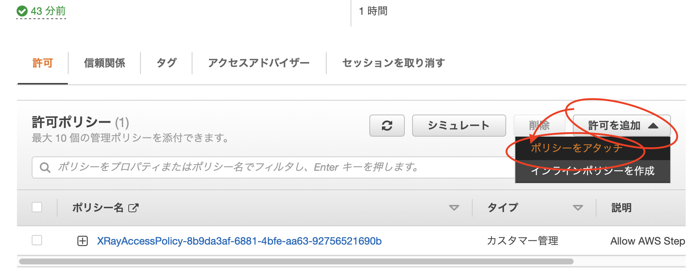
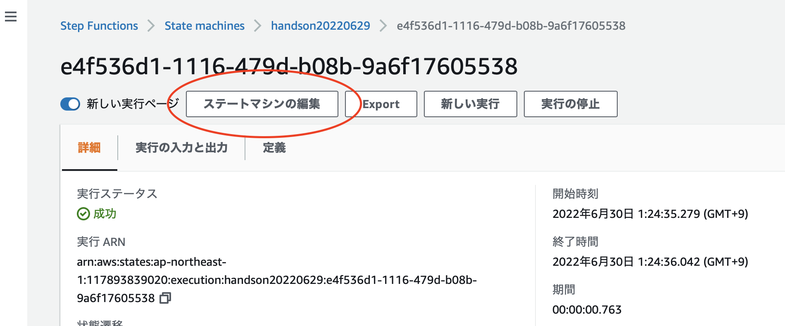
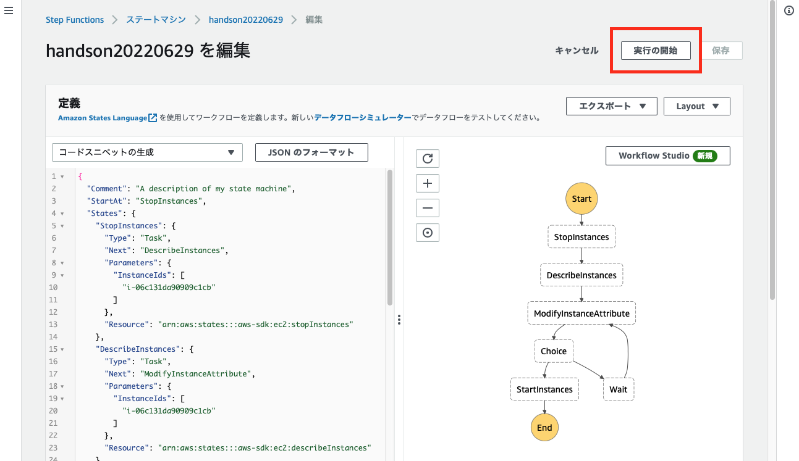

summary: AWS Step Functions Workflow Studio を使った入門ハンズオン
id: docs
categories: AWS Step Functions Workflow Studio
environments: Web
status: Draft
feedback link: https://github.com/otanikohei/AWS-StepFunctions---Workflow-Handson

# AWS Step Functions Workflow Studio を使った入門ハンズオン

## はじめに
Duration: 0:05:00



みなさんは、AWS Step Functions (以下、Step Functions) を利用したことがありますか？  
Step Functions は AWS のマネージドサービスで、ワークフローに AWS Lambda や Amazon Simple Nortification Service などのマイクロサービス・コンポーネントを疎結合して実行できるサービスです。  

そのワークフローを保存する箱をステートマシンと呼びます。  
以下は、ステートマシンとワークフローのイメージ図です。


### Amazon States Language

各ワークフローは、JSON ベースの Amazon States Language (以下、ASL) で記述していきます。現在は YAML での記述にも対応しましたが、ASL を理解してコーディングするのは、初心者には敷居が高く習熟する時間も必要です。  

  

### AWS Step Functions Workflow Studio
AWS Step Functions Workflow Studio (以下、Workflow Studio) は、2021 年にリリースされたステートマシンを構築するためのローコードのビジュアルツールです。  
これまでコーディングが必須だったワークフロー構築が、ブロックごとに繋いで視覚的に作成できるようになりました。

  

> AWS News Blog:  
[New – AWS Step Functions Workflow Studio – A Low-Code Visual Tool for Building State Machines](https://aws.amazon.com/jp/blogs/aws/new-aws-step-functions-workflow-studio-a-low-code-visual-tool-for-building-state-machines/)

## ハンズオンの概要

本ハンズオンでは Workflow Studio で「**ある特定の時間帯だけ EC2 インスタンスのインスタンスファミリーを変更する。**」という簡単なツールを作成します。  
ツールの作成を通じて Workflow Studio の使い方とステートマシンの概要を学ぶことができます。  

  

### 準備
セクション 3 〜 4 では、手動でインスタンスファミリーを変更する手順を学びます。

### 基本編
セクション 5 〜 10 では、インスタンスファミリーを変更する Step Functions を設定し、Workflow Studio の使い方や、ブロック間の値の渡し方などを学びます。  

### 応用編
セクション 11 以降では、Amazon EventBridge と連携して、指定時間にインスタンスファミリーを変更する方法を学びます。  
**EBS 最適化** に対応している次世代インスタンスと、**EBS 最適化** に対応していない旧インスタンスの切り替えに必要な属性の変更方法や、フローを使った分岐もご理解いただけます。  
また、各ステート間で受け渡す値を変数にして、EventBridge 側で一括変更する手法についても学ぶことができます。  

本ハンズオンを最後まで進めると JSON コーディングにステップを進めていただくための、基本的な使い方や概念が理解できるかと思います。 

<aside class="negative">EC2 インスタンスは起動している間に課金されます。ハンズオンが終了した後は必ず後片付けを実施ください。</aside>

### インスタンスファミリーを変更するフロー

Amazon EC2 インスタンスは、汎用 **m 系ファミリー** や、メモリー最適 **r 系ファミリー** など、用途に応じた様々なインスタンスタイプが用意されています。  
稼働しているインスタンスのインスタンスクラスやインスタンスサイズを変更するには、インスタンスを一旦停止する必要があります。  
大まかな流れは以下のようになります。  

 

まず、この手順を手動操作してみます。  

## 手動で EC2 インスタンスを起動

以下、URL をクリックして EC2 コンソールを開きます。  

[https://ap-northeast-1.console.aws.amazon.com/ec2/v2/home?region=ap-northeast-1#Home:](https://ap-northeast-1.console.aws.amazon.com/ec2/v2/home?region=ap-northeast-1#Home:)

画面遷移したら、オレンジ色の [ **インスタンスを起動 ▼** ] ボタンをクリックして、ドロップダウンメニューから [ **インスタンスを起動** ] を選択してください。  


### インスタンスを起動

[ **インスタンスを起動** ] の画面に遷移するので、Name タグを指定してください。  
本ハンズオンでは `handson20220629` としました。  

オレンジ色の [ **インスタンスを起動** ] ボタンをクリックすると、


以下のエラーが表示されるので、  


`キーペアなし` を指定してください。


<aside class="positive">このハンズオンは EC2 インスタンスのログイン操作が目的ではいため、必要最低限の設定にてインスタンスを起動しています。</aside>

## 手動でインスタンスファミリーを変更

インスタンスのステータスが [ **実行中** ] になったら、


インスタンスタイプの変更を試してみます。  
インスタンスのチェックボックスにチェックを入れて、[ **アクション** ] から [ **インスタンスの設定** ] と進めてください。  

すると、[ **インスタンスタイプを変更** ] がグレーアウトしています。


そこで、インスタンスを停止してみましょう。  
[ **インスタンスの状態** ] から [ **インスタンスを停止** ] を選択してください。


インスタンスの状態が [ **停止中** ] から


[ **停止済み** ] に変わります。


再度、[ **アクション** ] から [ **インスタンスの設定** ] と進めると、[ **インスタンスタイプを変更** ] が活性化されて押せるようになっています。  
[ **インスタンスタイプを変更** ] をクリックして、


`t2.micro` から `t3.nano` に変更してください。  


以上がインスタンスタイプを手動で変更する方法になります。  
この状態でインスタンスを起動すると EC2 インスタンスは t3.micro で上がってきますが、一旦停止のまま起動せずに置いておいてください。

## ステートマシンを作成する

前セクションで、手動による EC2 の変更手順を確認しました。  
続いて、手動変更手順を Step Functions にて実装します。  

まず最初に、EC2 コンソールを開いたウインドウ (ブラウザのタブ) とは別で以下 URL を開いてください。

[https://ap-northeast-1.console.aws.amazon.com/states/home?region=ap-northeast-1#/homepage](https://ap-northeast-1.console.aws.amazon.com/states/home?region=ap-northeast-1#/homepage)  

Step Functions コンソールが開きます。  
初めて利用される場合は、以下のようなウェルカムページが表示されるかと思います。  

[ **今すぐ始める** ] ボタンをクリックしてください。  

  

<aside class="positive">既にステートマシンを作成されたことのある方は、リストが表示されているかと思います。[ <strong>ステートマシンの作成</strong> ] ボタンをクリックして進めてください。</aside>

### 作成方法の選択

[ **作成方法の選択** ] 画面に遷移しますので、[ **ワークフローを視覚的に設計 ○** ] と [ **標準** ] のまま、変更せずに [ **次へ** ] ボタンをクリックしてください。  

  

<aside class="negative">::: 作成方法の選択 が開かない方 :::</aside>

上記の、[ **作成方法を選択** ] が表示されず、以下のように [ **Hello World サンプルを確認** ] が表示された場合は、一旦、画面右下にある [ **キャンセル** ] をクリックし、

  

左側のドロアーメニューを展開し、[ **ステートマシン** ] をクリックして、[ **ステートマシンの作成** ] をクリックすると [ **作成方法の選択** ] が表示されるかと思います。  

  

###  ステップ 2: ワークフローを設計

[ **ステップ 2: ワークフローを設計** ] が表示されたら、インスタンスを起動するアクションを追加してみます。  
[ **Workflow Sturio へようこそ！** ] のメッセージが表示された方は [ **×** ] アイコンをクリックして閉じてください。  


左側のペインにある検索ボックスに `startinstances` と入力し、候補に表示された [ **Amazon EC2 StartInstances** ] をフローまでドラッグします。

<aside class="negative">Amazon Lightsail や、OpsWorks の StartInstance など同じようなブロックが多数あります。間違えないよう気をつけてください！</aside>


右側の [ **API パラメータ** ] に EC2 インスタンスのインスタンス ID を入力してください。  

<aside class="informarion">インスタンス ID は EC2 コンソールで確認してください。</aside>

  

ここまでできたら、[ **次へ** ] ボタンをクリックしてください。  

  

### 生成されたコードを確認

[ **生成されたコードを確認 - 省略可能** ] 画面も [ **次へ** ] をクリックしてください。  
(スクリーンショットなし)

### ステートマシン設定を指定

[ **ステートマシン設定を指定** ] 画面に遷移するので、名前を設定します。ここでは `handson20220629` としました。  
また、アクセス許可は [ **新しいロールの作成** ] が選択されていることを確認してください。  

  

ログ記録、X-Ray トレースはエラー発生時の切り分けに便利ですが、本ハンズオンでは作成しません。  
タグも不要です。

  

オレンジの色の [ **ステートマシンの作成** ] ボタンをクリックしてください。


### ステートマシンを実行してみる

ステートマシンが作成されたら、[ **実行の開始** ] ボタンをクリックしてください。  
「実行の開始」という変な名前のボタンですが、上下どちらのボタンをクリックしても実行されます。


確認メッセージが表示されたら、再度オレンジの [ **実行の開始** ]ボタンをクリックします。


すると、エラーになります。エラーになった [ **States.TaskFailed ステップ: StartInstances** ] の [ **原因 ▶︎** ] をクリックすると、権限エラーが発生していたことがわかります。


権限エラーを解消するため、IAM コンソールにてポリシーをアタッチします。

## 実行ポリシーをアタッチする

前の手順で、Step Functions ステートマシンに `Amazon EC2 StopInstances` ステートを追加して、テスト実行しました。  
しかし、ステートマシンに権限が不足して、実行エラーになりました。

本ステップでは、IAM ポリシーを追加アタッチしてステートを実行できるようにします。

### IAM コンソールを開く

以下リンクから、3 つめのウインドウ (ブラウザのタブ) で IAM コンソールのロールページを開きます。

[https://us-east-1.console.aws.amazon.com/iamv2/home?region=us-east-1#/roles](https://us-east-1.console.aws.amazon.com/iamv2/home?region=us-east-1#/roles)

IAM ロールのページで、検索ボックスに `StepFunctions` まで入力して [ENTER] キーを押下すると、先ほどステートマシンを作成したときに自動生成されたロールが表示されます。  


<aside class="infomarion">複数表示される場合は、StepFunctions の画面からロール名を確認してください。  
パンくずリストでステートマシン名をクリックすると、IAM ロール ARN が表示されます。</aside>


ロールの名前をクリックして画面遷移したら、[ **許可を追加** ] から [ **ポリシーをアタッチ** ] ボタンをクリックして下さい。



`AmazonEC2FullAccess` のチェックボックスにチェックを入れて、[ **ポリシーをアタッチ** ] ボタンをクリックしてください。


<aside class="">本ハンズオンは操作を簡易にするため、FullAccess ポリシーをアタッチしています。最低限、以下のポリシーをアタッチすれば動きますので、参考にしていただければと思います。</aside>

#### <ターゲットのインスタンスのみで絞れるもの>
- EC2 StartInstances
- EC2 StopInstances
- EC2 ModifyInstanceAttribute

#### <すべて>
- EC2 DescribeInstances

## ステートの再実行

IAM ロールの設定ができたので、再度ステートを実行してみましょう。  
[ **新しい実行** ] ボタンをクリックします。


成功すると [ **StartInstances** ] のブロックが緑色になります。ブロックをクリックすると右側の [ **入力と出力** ] のタブに入力と出力の JSON コードがそれぞれ確認できます。


EC2 コンソールのウインドウ (ブラウザのタブ) に移動すると、インスタンスが起動しているのが確認できるかと思います。  
[ **停止済み** ] のステータスから変わらない方は、下図の [更新] ボタンをクリックして確認してください。  


## アクションの追加

EC2 インスタンスは Step Functions から起動させることができましたでしょうか。

ここから更にアクションブロックを追加していきます。  
インスタンスファミリーを変更するフローは以下の通りでした。

残りのアクションを、上から順番に入れていきましょう。  


### インスタンスを停止する

[ **ステートマシンの編集** ] ボタンをクリックし、



[ **Workflow Studio** ] をクリックします。


アクションから、[ **Amazon EC2 StopInstances** ] をドラッグして、[ **StartInstances** ] の上に挿入します。　　

[ **API パラメータ** ] にインスタンス ID を入力します。  


これで、インスタンスを止めれるようになりました。

<aside class="positive">API パラメータに入力する JSON は StopInstances に入力したものと同じです。</aside>

### インスタンスファミリーを変更する

インスタンスファミリーを変更するには、`ModifyInstanceAttribute` を利用します。

アクションから、[ **Amazon EC2 ModifyInstanceAttribute** ] をドラッグして、[ **StopInstances** ] と [ **StartInstances** ] の間に挿入します。　　

[ **API パラメータ** ] には、  

```json
{
  "InstanceId": "＜インスタンス ID＞",
  "Attribute": "instanceType",
  "Value": "m6i.large"
}
```

と入力してください。  

<aside class="positive">＜インスタンス ID＞ はご自身のインスタンス ID に書き換えてください。</aside>  

<aside class="positive">m6i.large インスタンスは m5.large インスタンスの、次世代 intel 製インスタンスです。</aside>  

<aside class="negative">t2.micro は t3.nano から変更すると、EBS ボリューム最適化の関係でエラーになるため m6i.large にしています。</aside>  

以下のようなイメージです。  


これで、インスタンスファミリーを「m6i.large」に変更できるようになりました。

### インスタンスが停止しているか確認する

インスタンスの停止状態は `DescribeInstances` を利用します。  
アクションから、[ **Amazon EC2 DescribeInstances** ] をドラッグして、[ **StopInstances** ] と [ **ModifyInstanceAttribute** ] の間に挿入します。　　


[ **API パラメータ** ] には、**StopInstances** のブロックに登録したものと同じ以下を入力してください。  

```json
{
  "InstanceIds": [
    "＜インスタンス ID＞"
    ]
}
```

<aside class="positive">＜インスタンス ID＞ はご自身のインスタンス ID に書き換えてください。</aside>  


## インスタンスの停止を待つ

一通りのアクションは追加できましたが、手動でインスタンスファミリーを変更した際のアクションをもっと細分化すると、  

- インスタンスが停止しているか確認する
- インスタンスが停止するのを待つ

というアクションが必要です。特に「待つ」アクションは人間だとよしなに行えますが、ステートマシンにやってもらう場合は待ち時間の設定などが必要です。  


### Choice

インスタンスが停止したかどうか「状態」は、前ステップで設定した `DescribeInstances` で取得できているため、「状態」をみて、次のステップに進むのか待つのか判断を挿入します。  

具体的には、Choice を使って分岐を入れます。

前手順までに [ **アクション** ] を複数追加してきましたが、アクションのすぐ横のタブに [ **フロー** ] がありますのでクリックしてください。  
「フロー」は、ステートマシンに分岐や待機といった人間が自然と行っている「考えて行動する」処理を追加する際に挿入します。  

Choice のブロックをドラッグして、[ **DescribeInstances** ] と [ **ModifyInstanceAttribute** ] の間に挿入してください。


挿入した Choice のブロックをクリックして選択します。  
すると右側に Choice の詳細ペインが表示されるので、判定ルールを追加します。  

判定基準は「インスタンスが停止したかどうか？」です。  

[ **Rule #1** ] の右側にあるリンクボタンをクリックして、


[ **Add conditions** ] ボタンをクリックします。  


[ **Conditions for rule #1** ] ダイヤログが開くので、以下の内容を入力して [ **条件を保存する** ] ボタンをクリックしてください。

|  **Not**  |  **Variable** | **Operator** | **Value** |
| ---- | ---- | ---- | ---- |
|  空欄  |  $.Reservations[0].Instances[0].State.Name  | matches string | stopped |

<aside class="positive">stopped というステータスでインスタンスの停止状態を判定します。</aside>

以下のようなイメージです。


### インスタンスが停止していた場合のアクション

インスタンスが停止していたら、次のステート **ModifyInstanceAttribute** でインスタンスファミリーを変更しますので、[ **Then next state is:** ] のドロップダウンメニューから [ **ModifyInstanceAttribute** ] を選択してください。


### インスタンスが停止していない場合のアクション

インスタンスが停止していない場合は、停止するまで待つ必要があります。  
ステートの処理を待機させるには `wait` を使います。  
[ **フロー** ] タブから、[ **wait** ] ブロックをドラッグして、[ **Default** ] 側にドロップしてください。


右側の詳細ペインで、秒を `30` seconds に、次の状態を `DescribeInstances` にします。


### ステートマシンを保存する

これで完成です！  
以下の画像と見比べて異なる部分があれば修正してください。


問題なければ、[ **適用して終了** ] ボタンをクリックしてください。


<aside class="negative">この時点では Workflow Studio を終了しただけで、ステートマシンの設定は保存されていません。必ず次の手順を行って保存してください。</aside>

Step Functions の画面に戻るので、[ **保存** ] ボタンをクリックして、ステートマシンの設定を保存してください。


確認メッセージが表示されますので、[ **保存を続行します** ] ボタンをクリックして、保存します。


## テスト

準備が整いましたので、テスト実行してみてください。



ステートが進んでいくのがお分かりいただけるかと思います。  
水色が実行されているステートで、緑が成功したステートになります。


EC2 コンソールから、インスタンスが m6i.large で起動したことを確認してください。  

<aside class="positive">確認できたら、課金を止めるためインスタンスを停止してください。</aside>


インスタンスが停止できたら、本ハンズオンの基本編は終了です。  
一旦、お疲れ様でした。  

ここで終了する方は、後片付けのセッションまでジャンプしてください。

## アドバンスドステップ

うまくインスタンスファミリーは変更できたでしょうか。  
概要のみ記載しておきますので、余力のある方にトライいただければと思います。  

1. EventBridge を設定して、指定した時刻にインスタンスファミリーを変更する
2. Choice を利用して t3.nano なら t2.micro に、t2.micro なら t3.nano に変更する
3. API パラメータを変数化して EventBridge のパラメータでインスタンスタイプを変更する

------

## 1. EventBridge を設定して、指定した時刻にインスタンスファミリーを変更する

それでは、作成したステートマシンを指定した時刻に起動させてみましょう。  

現在、m6i.large で起動している方は、(停止していても大丈夫です。) ステートマシンの [ **ModifyInstanceAttribute** ] を編集して「t3.micro」にしてください。


パンくずリストから、作成したステート名をクリックして、[ **アクション ▼** ] から [ **EventBridge (CloudWatch イベント) ルールを作成** ] ボタンをクリックします。


EventBridge が別ウインドウで開きますので、[ **名前** ] を設定してルールタイプを [ **スケジュール** ] に変更し、[ **次へ** ] ボタンをクリックします。


スケジュールパターンはひとまず [ **○ 通常レートで実行されるスケジュール(10分ごとなど)。** ] を選択して、[ **レート式** ] は 5 分にしてみましょう。  
[ **次へ** ] ボタンをクリックしてください。


[ **ターゲットを選択する** ] 画面に遷移するので、以下を設定してください。  

|ターゲットタイプ|○ AWS のサービス|
| --- | --- |
|ターゲットの選択|Step Functions ステートマシン|
|ステートマシン|handson20220629|
|実行ロール|この特定のリソースについて新しいロールを作成|

設定できたら、[ **次へ** ] をクリックして進めてください。


[ **タグを設定 - オプション** ] はそのまま [ **次へ** ] をクリックして進めてください。  
(スクリーンショットなし)

[ **レビューと作成** ] で内容を確認したら、[ **ルールの作成** ] をクリックしてください。

### モニタリング

作成したルールをクリックして、モニタリングタブから実行状態が確認できます。  
更新ボタンをクリックして状態を最新にしながら、Invocation (呼び出し) にメトリクスが記録されるのを確認してください。  
確認できたら、実行できているので [無効化] ボタンをクリックし、5 分に 1 回 実行されるのを止めましょう。


EC2 コンソールに移動し、更新ボタンをクリックすると


インスタンスタイプが変わって起動したのが確認できます。


## 2. Choice を利用して t3.nano なら t2.micro に、t2.micro なら t3.nano に変更する

ここまでの手順で、指定した時間にインスタンスタイプが変更できるようになりました。  

次は、ステートマシンを直接修正する必要がないように、現在のインスタンスサイズを確認して、t3.micro なら t2.micro に、t2.micro なら t3.micro に、トグル的に変更できるようにしたいと思います。  

### t2.micro は EBS 最適化に対応していない

t2.micro は旧世代のインスタンスで、EBS 最適化に対応していません。  
手動でインスタンスタイプを変更しようとすると、EBS に最適化のチェックボックスがグレーアウトしていますが、最適化に対応していないと表示されます。


先の手順で少し触れましたが、Step Functions だと、この、「EBS 最適化」の状態のまま t2.micro で起動しようとするため、`StartInstances` のブロックで起動に失敗することがあります。  

具体的には「EBS 最適化」が有効になって稼働しているインスタンスを Step Functions で、API パラメータで `t2.micro` を指定して実行すると、`StartInstances` のブロックでエラーになります。  


### ワークフロー 例

組み方はいろいろ考えられますが、サンプルをご用意しました。  
全体像は以下の通りです。  

ブロックごとに解説していきます。


### Choice (1)

このブロックでは、現在のインスタンスが t2.micro かそうでないかを判定しています。  
Rule #1 には以下を設定しました。

|Not|Variable|Operator|Value|
|---|---|---|---|
|空欄|$.Reservations[0].Instances[0].InstanceType|match string|t2.micro|

### ModifyInstanceAttribute

こちらは現在のインスタンスタイプが `t2.micro` の場合の分岐です。  
1 つ目の ModifyInstanceAttribute ではインスタンスタイプを `t3.nano` に設定します。  
API パラメータに以下を設定しました。

```json
{
  "InstanceId": "＜インスタンス ID＞",
  "Attribute": "instanceType",
  "Value": "t3.nano"
}
```

### ModifyInstanceAttribute (2)

2 つ目の ModifyInstanceAttribute では EBS 最適化を有効化します。  
API パラメータに以下を設定しました。

```json
{
  "InstanceId": "＜インスタンス ID＞",
  "Attribute": "ebsOptimized",
  "Value": "true"
}
```

### ModifyInstanceAttribute (3)

こちらは現在のインスタンスタイプが `t3.nano` の場合の分岐です。  
1 つ目の ModifyInstanceAttribute ではインスタンスタイプを `t2.micro` に設定します。  
API パラメータに以下を設定しました。

```json
{
  "InstanceId": "＜インスタンス ID＞",
  "Attribute": "instanceType",
  "Value": "t2.micro"
}
```

### ModifyInstanceAttribute (2)

2 つ目の ModifyInstanceAttribute では EBS 最適化を無効化します。  
API パラメータに以下を設定しました。

```json
{
  "InstanceId": "＜インスタンス ID＞",
  "Attribute": "ebsOptimized",
  "Value": "false"
}
```
正しく設定ができると、ステートマシンを実行した際に以下のような動きになります。


## 3. API パラメータを変数化して EventBridge のパラメータでインスタンスタイプを変更する

これが本ハンズオンの最後のステップになります。  
本ステップでは、API パラメータに入力してきた値を一部変数にして、EventBridge からパラメータを渡せるようにします。  
具体的に記載しますと、

```json
{
  "InstanceIds": [
    "i-06c131da90909c1cb"
  ]
}
```

と、ハードコーディングしてきたインスタンス ID を

```json
{
  "InstanceIds.$": "States.Array($.INSTANCE_ID)"
}
```

といった形で変数にしましょう。というステップです。  
「変数化」を行うことで、仮にインスタンス ID が変わったときでも、それぞれのブロックに設定してきた API パラメータを全て書き換えることなく、トリガー元の EventBridge で一元管理して対応できます。  

### ASL の Intrinsic 関数

上記コードに、`States.Array()` という関数的なものが初登場しました。  

本ハンズオンでは、Workflow Studio を使った GUI の操作をメインに説明してきましたが、パラメータ入力は、`States.Array()` をはじめとした 「Intrinsic 関数」を使う必要があります。  
ただ、関数の種類はそんなに数は多くありません。分からなくなったら以下ドキュメントを参照してください。

[Intrinsic functions](https://docs.aws.amazon.com/step-functions/latest/dg/amazon-states-language-intrinsic-functions.html)

#### JSON データの受け渡し

また、`InstanceIds` の後ろに `.$` があり、`INSTANCE_ID` の手前には `$.` があります。  
これも「Intrinsic 関数」です。`$` に関しては、API パラメータの下部にもコメントが記載されています。


### ワークフロー 例

一つ前のステップにてご紹介したワークフローを使って、変数の書き換え方法をブロックごとに解説します。


#### StopInstances

`StopInstances` のブロックで修正するのは 2 点です。  
まず、API パラメータを以下のとおり変数化します。

```json
{
  "InstanceIds.$": "States.Array($.INSTANCE_ID)"
}
```

次に、出力タブに移動して、`ResultPath を使用して元の入力を出力に追加 - 省略可能` のチェックボックスにチェックを入れて、`Combine original input with result` を `$.Output` にしてください。

こんな感じです。  


この `ResultPath を使用して元の入力を出力に追加` を行うと、通常の出力に加えて、入力のデータも次のステートに渡せるようになります。つまりどういうことかと言うと、以下のように `SopInstances` が 入力で受けた `INSTANCE_ID` を出力の上部に追加しているのが分かりますでしょうか。  
こんな感じで、次のステートに情報をアドオンして渡せるのです。


####  DescribeInstances

`DescribeInstances` のブロックで行うことも 2 点で、`StopInstances` と同様です。

まず、API パラメータは以下に修正してください。

```
{
  "InstanceIds.$": "States.Array($.INSTANCE_ID)"
}
```

出力タブに移動して、`ResultPath を使用して元の入力を出力に追加 - 省略可能` のチェックボックスにチェックを入れて、`Combine original input with result` を `$.Output` にしてください。

#### Choice

1 つ目の `Choice` で変更するのは 1 点のみです。  
Rule #1 の `Variable` を  

`$.Reservations[0].Instances[0].State.Name`  

から、  

`$.Output.Reservations[0].Instances[0].State.Name`  

に変更してください。

#### Choice (2)

2 つ目の `Choice` も同様に Rule #1 の `Variable` を  

`$.Reservations[0].Instances[0].InstanceType`  

から  

`$.Output.Reservations[0].Instances[0].InstanceType`  

に変更してください。

#### ModifyInstanceAttribute

`ModifyInstanceAttribute` は 4 つとも、API パラメータに記載したインスタンス ID の行を以下に修正してください。  

```json
  "InstanceId.$": "$.INSTANCE_ID",
```

出力タブに移動して、`ResultPath を使用して元の入力を出力に追加 - 省略可能` のチェックボックスにチェックを入れて、`Combine original input with result` を `$.Output` にしてください。

#### StopInstances

`StopInstances` も API パラメータを以下に修正してください。

```
{
  "InstanceIds.$": "States.Array($.INSTANCE_ID)"
}
```

#### テスト

これまではテストの際に渡す JSON データを変更せずに実行していましたが、今回は INSTANCE_ID の値を渡す必要があります。
[ **新しい実行** ] ボタンをクリックして、[ **JSON フォーマット** ] に以下を入力してください。

```
{
    "INSTANCE_ID": "＜インスタンス ID＞"
}
```

<aside class="positive">＜インスタンス ID＞ はインスタンスの ID に書き換えてください。</aside>

### EventBrige

うまく実行できたでしょうか。最後に EventBridge の設定を変更します。  
既に EventBridge のウインドウ (ブラウザのタブ) を閉じた方は、以下をクリックして開いてください。

[https://ap-northeast-1.console.aws.amazon.com/events/home?region=ap-northeast-1#/rules](https://ap-northeast-1.console.aws.amazon.com/events/home?region=ap-northeast-1#/rules)

先の手順で無効化したイベントを開き、下部にある [ **ターゲット** ] タブの [ **編集** ] ボタンをクリックします。


下部にある [ **▶︎ 追加設定** ] を展開し、[ **定数 (JSON テキスト)** ] にしたら、以下 JSON を入力してください。

```
{
    "INSTANCE_ID": "＜インスタンス ID＞"
}
```

<aside class="positive">＜インスタンス ID＞ はインスタンスの ID に書き換えてください。</aside>

こんな感じです。ルールを更新して、有効化し、イベントが実行されてインスタンスファミリーが変更されるのを確認してください。


## 後片付け

みなさんお疲れ様でした。ハンズオン終了後も継続して従量課金されないよう、本ハンズオンで作成したリソースは削除してください。  
継続して課金が行われるケースとしては、以下が考えられます。  

- EC2 インスタンスが起動したまま、課金されていた
- EventBridge を削除し忘れて、ステートが何度も実行されていた

**意図しないコストを避けるためリソース削除をお願いします。**  

### セキュリティグループ

EC2 インスタンスを削除する前に、セキュリティグループの名前を控えてください。  

[EC2 コンソール](https://ap-northeast-1.console.aws.amazon.com/ec2/v2/home?region=ap-northeast-1#Instances:v=3) を開き、該当の EC2 インスタンスにチェックを入れて、[ **セキュリティ** ] タブからセキュリティグループの名前を控えます。


<aside class="positive"> (launch-wizard-X) という名前がついているかと思います。</aside>

### EC2 インスタンス

EC2 にチェックを入れて、[ **インスタンスの状態** ] から、[ **インスタンスを終了** ] ボタンをクリックしてください。  
インスタンスの状態が「終了済み」となっていたら、そのうち非表示になりますので問題ございません。  

EC2 を終了できたら、先ほど控えたセキュリティグループを削除してください。

[EC2 のセキュリティグループ](https://ap-northeast-1.console.aws.amazon.com/ec2/v2/home?region=ap-northeast-1#SecurityGroups) を開き、削除してください。

### ステートマシン

[Step Functions のステートマシン一覧](https://ap-northeast-1.console.aws.amazon.com/states/home?region=ap-northeast-1#/statemachines) を開き、該当のステートマシンを選択して [削除] ボタンをクリックして削除してください。  
削除前に、アタッチされた IAM ロールの名前を控えておいてください。

### EventBridge のルール

[EventBridge のルール一覧](https://ap-northeast-1.console.aws.amazon.com/events/home?region=ap-northeast-1#/rules) を開き、該当のルールを開いてください。  
EventBridge ルールを削除する前に、[ **ターゲット** ] タブから作成した IAM ロールの名前を控えておいてください。

ルールは画像の右側に表示されている [ **削除** ] ボタンから削除してください。


### IAM ロール

[IAM ロールのページ](https://us-east-1.console.aws.amazon.com/iamv2/home?region=us-east-1#/roles) にアクセスし、
「StepFunctions-handson20220629-role-xxxxxxxx」と「Amazon_EventBridge_Invoke_Step_Functions_xxxxxxxxxxxxxxxx」を削除して下さい。複数ある場合は、先の削除手順で控えたメモを参照しながら、対象のロールを削除してください。

