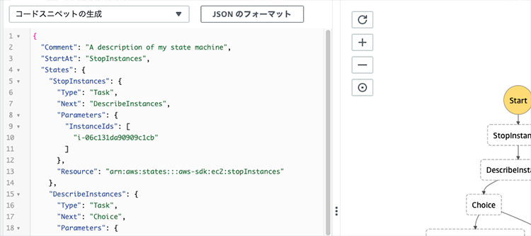
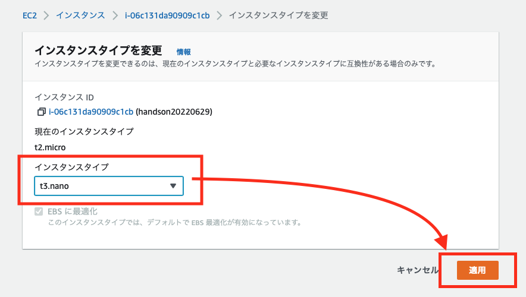
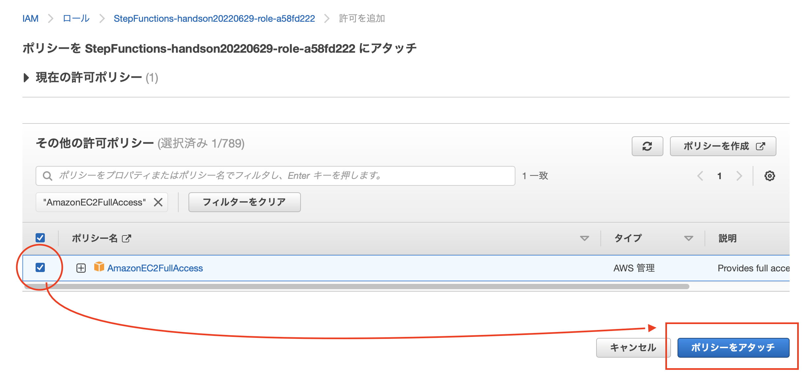
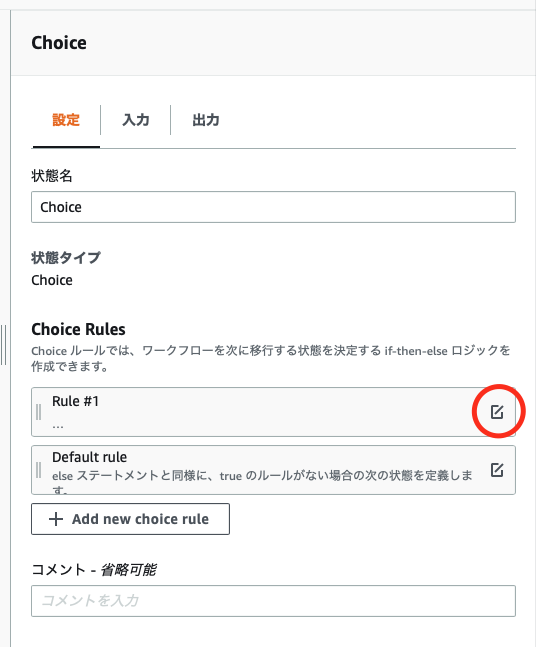
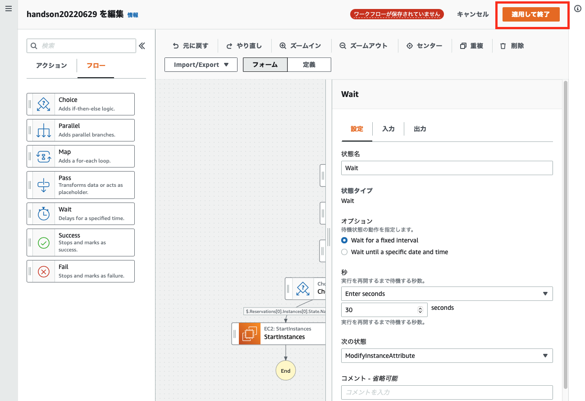
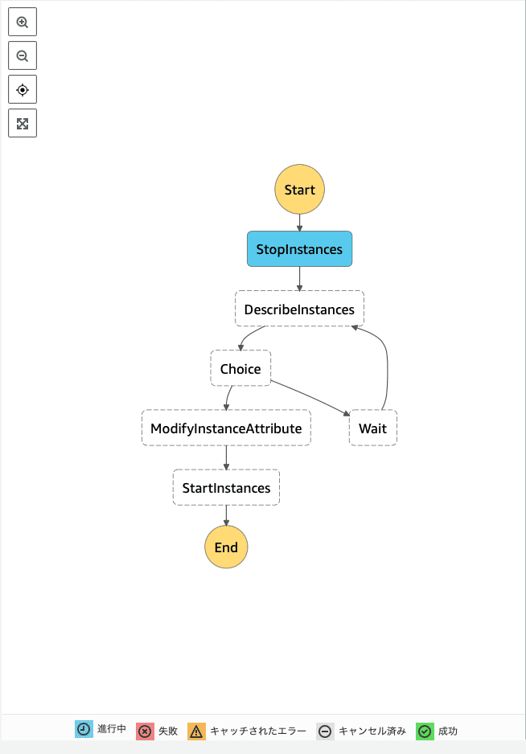

summary: AWS Step Functions Workflow Studio を使った入門ハンズオン
id: docs
categories: AWS Step Functions Workflow Studio
environments: Web
status: Published
feedback link: k-otani@forgevision.com

# AWS Step Function の AWS Step Functions Workflow Studio を使った入門ハンズオン

## はじめに
Duration: 0:05:00


みなさんは、AWS Step Functions (以下、Step Function) を利用したことがありますか？  
Step Functions はステートマシンという AWS のマネージドサービスで、AWS Lambda や Amazon Simple Nortification Service などのマイクロサービス・コンポーネントを疎結合して実行できるサービスです。  

### Amazon States Language

Step Fuctions は、JSON ベースの Amazon States Language (ASL) にて記載していきます。この ASL を利用して各ステートをコーディングしながら組み上げていくのは、初心者には敷居が高く習熟する時間も必要です。  

  

### AWS Step Functions Workflow Studio
AWS Step Functions Workflow Studio (以下、Workflow Studio) は、2021 年 6 月にリリースされた GUI ベースのグラフィカルなコーディングツールです。
ブロックを繋いでいくことで、ワークフローを作成することができ、アクションやフローが比較的短時間でワークフローの作成方法をご理解いただければと思います。

  

> AWS News Blog:  
[New – AWS Step Functions Workflow Studio – A Low-Code Visual Tool for Building State Machines](https://aws.amazon.com/jp/blogs/aws/new-aws-step-functions-workflow-studio-a-low-code-visual-tool-for-building-state-machines/)

## ハンズオンの概要

本ハンズオンでは「**ある特定の時間帯だけ EC2 インスタンスのインスタンスファミリーを変更する。**」という簡単なツールを作成します。  
Step Function Stuio の使い方や、ブロック間の値の渡し方などを理解いただき、最終的に JSON コーディングにステップを進めていただく初心者向けの内容となっています。  

  

<aside class="warning">EC2 インスタンスを起動していると課金されますので、ハンズオンが終了した後は必ず [後片付け]() を実施ください。</aside>

### インスタンスファミリーを変更するフロー

Amazon EC2 インスタンスは、汎用 **m 系ファミリー** や、メモリー最適 **r 系ファミリー** など、用途に応じた様々なインスタンスタイプが用意されています。  
インスタンスファミリーやインスタンスサイズを変更するには、インスタンスを停止する必要があります。  
大まかな流れは以下のようになります。  

 

まず、この手順を手動で体験いただきます。

## EC2 インスタンスを起動

以下、URL をクリックして EC2 コンソールを開きます。  

[https://ap-northeast-1.console.aws.amazon.com/ec2/v2/home?region=ap-northeast-1#Home:](https://ap-northeast-1.console.aws.amazon.com/ec2/v2/home?region=ap-northeast-1#Home:)

画面遷移したら、オレンジ色の [ **インスタンスを起動 ▼** ] ボタンをクリックして、ドロップダウンメニューから [ **インスタンスを起動** ] を選択してください。  


### インスタンスを起動

[ **インスタンスを起動** ] の画面に遷移するので、Name タグを指定してください。  
ここでは `handson20220629` としました。  

オレンジの [ **インスタンスを起動** ] ボタンをクリックすると、


以下のエラーが表示されるので、  


`キーペアなし` を指定してください。


<aside class="information">このハンズオンは EC2 インスタンスのログイン操作が目的ではいため、必要最低限の設定にてインスタンスを起動しています。</aside>

## インスタンスファミリーを変更

インスタンスのステータスが [ **実行中** ] になったら、インスタンスタイプの変更を試してみます。  
インスタンスのチェックボックスにチェックを入れて、[ **アクション** ] から [ **インスタンスの設定** ] と進めてください。すると、[ **インスタンスタイプを変更** ] がグレーアウトしています。


では、インスタンスを停止してみましょう。  
[ **インスタンスの状態** ] から [ **インスタンスを停止** ] を選択してください。


インスタンスの状態が [ **停止中** ] から


[ **停止済み** ] に変わります。


再度、[ **アクション** ] から [ **インスタンスの設定** ] と進めると、[ **インスタンスタイプを変更** ] が活性化されて押せるようになっています。  
[ **インスタンスタイプを変更** ] をクリックして、


`t2.micro` から `t3.nano` に変更してください。  



## ステートマシンを作成する

EC2 の変更手順を確認して、改めてインスタンスファミリーの変更方法をご理解いただけたかと思います。  
この作業を Step Functions にて実装します。  

まず最初に、EC2 コンソールのブラウザタブとは別のタブで以下 URL を開き、Step Functions コンソールにアクセスしてください。  
初めて利用される場合は、以下のようなウェルカムページが表示されるかと思います。  

[https://ap-northeast-1.console.aws.amazon.com/states/home?region=ap-northeast-1#/homepage](https://ap-northeast-1.console.aws.amazon.com/states/home?region=ap-northeast-1#/homepage)  

[ **今すぐ始める** ] ボタンをクリックしてください。  

  

<aside class="information">既にステートマシンを作成されたことのある方は、リストが表示されているかと思います。[ <strong>ステートマシンの作成</strong> ] ボタンをクリックして進めてください。</aside>

### 作成方法の選択

[ **作成方法の選択** ] 画面に遷移しますので、[ **ワークフローを視覚的に設計 ○** ] と [ **標準** ] のまま、変更せずに [ **次へ** ] ボタンをクリックしてください。  

  

[ **ステップ 2: ワークフローを設計** ] が表示されるので、インスタンスを起動するアクションを追加してみます。  
[ **Workflow Sturio へようこそ！** ] のメッセージは [ **×** ] アイコンをクリックして閉じてください。  


検索ボックスに `startinstances` と入力し、候補に表示された [ **Amazon EC2 StartInstances** ] をフローまでドラッグします。


右側の [ **API パラメータ** ] に EC2 インスタンスのインスタンス ID を入力してください。  

  

ここまでできたら、[ **次へ** ] ボタンをクリックしてください。  

  

[ **生成されたコードを確認 - 省略可能** ] 画面も [ **次へ** ] をクリックしてください。  
(スクリーンショットなし)

[ **ステートマシン設定を指定** ] 画面に遷移するので、名前を設定します。ここでは `handson20220629` としました。  
また、アクセス許可は [ **新しいロールの作成** ] が選択されていることを確認してください。  

  

ログ記録、X-Ray トレースはエラー発生時の切り分けに便利ですが、本ハンズオンでは作成しません。  
タグも不要です。

  

オレンジの色の [ **ステートマシンの作成** ] ボタンをクリックしてください。


ステートマシンが作成されたら、[実行の開始] ボタンをクリックしてください。  
変な名前のボタンですが、上下どちらのボタンをクリックしても実行されます。


確認メッセージが表示されたら、再度オレンジの [ **実行の開始** ]ボタンをクリックします。


すると、エラーになります。赤くなっているブロック [StartInstances] をクリックし、右側のペインの [例外] タブをクリックすると、権限エラーが発生していたことがわかります。


IAM コンソールにてポリシーをアタッチします。

## 実行ポリシーをアタッチする

以下リンクから、3 つめのウインドウで IAM コンソールのロールページを開きます。

[https://us-east-1.console.aws.amazon.com/iamv2/home?region=us-east-1#/roles](https://us-east-1.console.aws.amazon.com/iamv2/home?region=us-east-1#/roles)

IAM ロールのページで、検索ボックスに `StepFunctions` まで入力すると、先ほどステートマシンを作成したときに自動生成されたロールが表示されます。  


<aside class="infomarion">複数表示される場合は、StepFunctions の画面からアタッチしたロールを確認してください。</aside>

ロールの名前をクリックして画面遷移したら、[ **許可を追加** ] から [ **ポリシーをアタッチ** ] ボタンをクリックして下さい。


`AmaoznEC2FullAccess` のチェックボックスにチェックを入れて、[ **ポリシーをアタッチ** ] ボタンをクリックしてください。



追加で、`AmazonSSMManagedInstanceCore` もアタッチしておいてください。


以下のようなポリシーになれば OK です。  
IAM コンソールのウインドウを閉じて、次のステップに進んでください。


<aside class="">本ハンズオンでは簡易にするため、FullAccess ポリシーをアタッチしています。最低限、以下のポリシーをアタッチすれば動きますので、参考にしていただければと思います。</aside>

#### <ターゲットのインスタンスのみで絞れるもの>
- EC2 StartInstances
- EC2 StopInstances

#### <該当のパラメーターだけで絞れるもの>
- SSM GetParameters

#### <すべて>
- EC2 DescribeInstances

## ステートの再実行

IAM ロールの設定ができたので、再度ステートを実行してみましょう。  
[ **新しい実行** ] ボタンをクリックします。


成功すると [ **StartInstances** ] のブロックが緑色になります。ブロックをクリックすると右側の [ **入力と出力** ] のタブに入力と出力の JSON コードがそれぞれ確認できます。


EC2 コンソールのタブに移動すると、インスタンスが起動しているのが確認できるかと思います。  
[ **停止済み** ] のステータスから変わらない方は、下図の [更新] ボタンをクリックして確認してください。  


## アクションの追加

更にアクションブロックを追加していきます。  
インスタンスファミリーを変更するフローは以下の通りでした。


### インスタンスを停止する

上から順番にアクションを入れていきましょう。  
[ **ステートマシンの編集** ] ボタンをクリックし、


[ **Workflow Studio** ] をクリックします。


アクションから、[ **EC2: StopInstances** ] をドラッグして、[ **StartInstances** ] の上に挿入します。　　

[ **API パラメータ** ] にインスタンス ID を入力します。  


これで、インスタンスを止めれるようになりました。

### インスタンスファミリーを変更する

インスタンスファミリーを変更するには、`ModifyInstanceAttribute` を利用します。

アクションから、[ **EC2: ModifyInstanceAttribute** ] をドラッグして、[ **StopInstances** ] と [ **StartInstances** ] の間に挿入します。　　

[ **API パラメータ** ] には、  

```
{
  "InstanceId": "＜インスタンス ID＞",
  "Attribute": "instanceType",
  "Value": "m6i.large"
}
```

と入力してください。  

<aside class="information">＜インスタンス ID＞ はご自身のインスタンス ID に書き換えてください。</aside>  

<aside class="information">m6i.large インスタンスは、m5.large インスタンスの次世代 intel 製インスタンスです。</aside>  

以下のようなイメージです。  


これで、インスタンスファミリーを「t2.micro」に変更できるようになりました。

### インスタンスが停止しているか確認する

インスタンスの停止状態は `DescribeInstances` を利用します。  
アクションから、[ **EC2: DescribeInstances** ] をドラッグして、[ **StopInstances** ] と [ **ModifyInstanceAttribute** ] の間に挿入します。　　


[ **API パラメータ** ] には、**StopInstances** のブロックに登録したものと同じ以下を入力してください。  

```
{
  "InstanceIds": ["＜インスタンス ID＞"]
}
```

<aside class="information">＜インスタンス ID＞ はご自身のインスタンス ID に書き換えてください。</aside>  


## インスタンスの停止を待つ

一通りのアクションは追加できましたが、手動でインスタンスファミリーを変更した際のアクションをもっと細分化すると、  

- インスタンスが停止しているか確認する
- インスタンスが停止するのを待つ

というアクションを人間がよしなに行っています。これを機械にやってもらうための設定をします。  


### Choice

インスタンスが停止したかどうか「状態」は、`DescribeInstances` で取れているので、この取得した「状態」をみて、次のステップに進むのか待つのか判断をする必要があります。  
Choice を使って分岐を入れます。

ここまで [ **アクション** ] を追加してきましたが、すぐ横に [ **フロー** ] があるのでクリックしてください。  
フローには、分岐や待機といった人間が自然と行っている「考えて行動する」処置を行うための機能があります。  

Choice をドラッグして、[ **DescribeInstances**] と [ **StopInstances** ] の間に挿入してください。


判定は基準はインスタンスが停止したかどうか？です。  
[ **Rule #1** ] をクリックして、



[ **Add conditions** ] ボタンをクリックします。  


[ **Conditions for rule #1** ] ダイヤログが開くので、以下の内容を入力して [ **条件を保存する** ] ボタンをクリックしてください。

|  **Not**  |  **Variable** | **Operator** | **Value** |
| ---- | ---- | ---- | ---- |
|  空欄  |  $.Reservations[0].Instances[0].State.Name  | matches string | stopped |

<aside class="information">stopped というステータスで判定します。</aside>

以下のようなイメージです。


インスタンスが停止している場合は、**StartInstances** のステートでインスタンスを起動するので、[ **Then next state is:** ] のドロップダウンメニューから [ **StartInstances** ] を選択してください。


### インスタンスが停止していない場合のアクション

インスタンスが停止していない場合は、停止するまで待つ必要があります。  
ステートの処理を待機させるには `wait` を使います。  
[ **フロー** ] タブから、[ **wait** ] ブロックをドラッグして、[Default] 側にドロップしてください。


右側の詳細ペインで、秒を `30` seconds に、次の状態を `ModifyInstanceAttribute` にします。


これで完成です！  
以下の画像と見比べて異なる部分があれば修正してください。


問題なければ、[ **適用して終了** ] ボタンをクリックしてください。



<aside class="warning">この時点では Workflow Studio を終了しただけで、ステートマシンの設定は保存されていません。必ず次の手順を行って保存してください。</aside>

Step Functions の画面に戻るので、[ **保存** ] ボタンをクリックして、ステートマシンの設定を保存してください。


確認メッセージが表示されますので、[ **保存を続行します** ] ボタンをクリックして、保存します。


## テスト

準備が整いましたので、テスト実行してみてください。


ステートが進んでいくのがお分かりいただけるかと思います。  
水色が実行されているステートで、緑が成功したステートになります。



EC2 コンソールから、インスタンスが m6i.large で起動したことを確認してください。  

<aside class="information">確認できたら、課金と止めるためインスタンスを停止してください。</aside>


